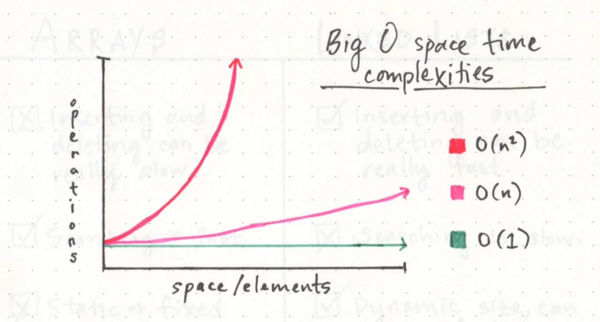

# **Linked Lists**
---
---

### **What is a Linked List :**
**A Linked List** is a sequence of Nodes that are connected/linked to each other. The most defining feature of a Linked List is that each Node references the next Node in the link.

There are two types of Linked List - Singly and Doubly. We will be implementing a Singly Linked List in this implementation.

### **Terminology :**
- **Linked List :** A data structure that contains nodes that links/points to the next node in the list.
- **Singly :** A Singly linked list means that there is only one reference, and the reference points to the Next node in a linked list.
- **Doubly :** A Doubly linked list means that there is a reference to both the Next and Previous node.
- **Node :** Nodes are the individual items/links that live in a linked list. Each node contains the data for each link.
- **Next :** Each node contains a property called Next. This property contains the reference to the next node.
- **Head :** The Head is a reference of type Node to the first node in a linked list.
- **Current :** The Current is a reference of type Node to the node that is currently being looked at. When traversing, you create a new Current variable at the Head to guarantee you are starting from the beginning of the linked list.

**This is what a Singly Linked List looks like :**

### **Traversal Big O :**
- The Big O of time for Includes would be O(n). This is because, at its worse case, the node we are looking for will be the very last node in the linked list. n represents the number of nodes in the linked list.

- The Big O of space for Includes would be O(1). This is because there is no additional space being used than what is already given to us with the linked list input.

### **Linear data structures VS NON Linear data structures :**
One characteristic of linked lists is that they are **linear data structures**, which means that there is a sequence and an order to how they are constructed and traversed.

### **Memory management :**
The biggest differentiator between arrays and linked lists is the way that they use memory in our machines. Those of us who work with dynamically typed languages like Ruby, JavaScript, or Python don’t have to think about how much memory an array uses when we write our code on a day to day basis because there are several layers of abstraction that end up with us not having to worry about memory allocation at all.

### **Big O :**
Most of us have probably heard the term “Big O Notation”, even if we had no idea what it meant the first time that we heard someone use it. My personal experience with it has always been in the context of designing algorithms (or being asked to evaluate the efficiency of an algorithm). But Big O is really all over and omnipresent within computer science.

**Speed(Performance) VS Big(O)**

## **NOTE && (( Linked List VS Array ))**
**a linked list is usually efficient when it comes to adding and removing most elements, but can be very slow to search and find a single element.**
If you ever find yourself having to do something that requires a lot of traversal, iteration, or quick index-level access, a linked list could be your worst enemy. In those situations, an array might be a better solution, since you can find things quickly (a single chunk of allocated memory), and you can use an index to quickly retrieve a random element in the middle or end of the list without having to take the time to traverse through the whole entire thing.

---
---
#### **References**
[Linked List Part 1](https://medium.com/basecs/whats-a-linked-list-anyway-part-1-d8b7e6508b9d)
 
[Linked List Part 2](https://medium.com/basecs/whats-a-linked-list-anyway-part-2-131d96f71996)

---
- [BACK (Main Page)](./README.md)
---

