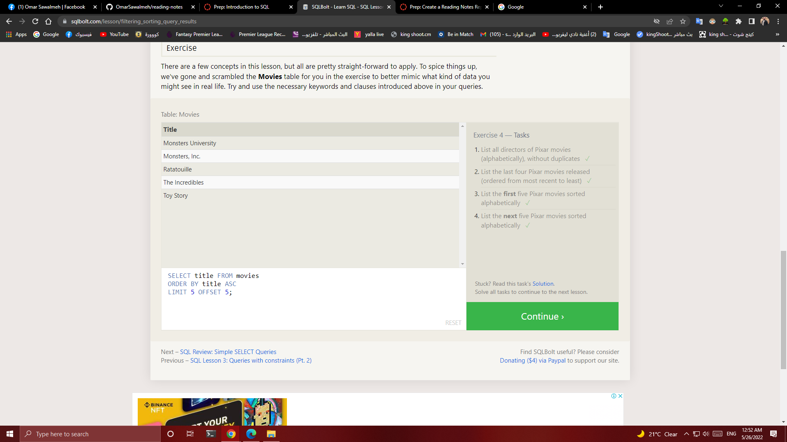

# Structured Query Language (SQL)
#### Structured Query Language (SQL) is a standardized programming language that is used to manage relational databases and perform various operations on the data in them. Initially created in the 1970s, SQL is regularly used not only by database administrators, but also by developers writing data integration scripts and data analysts looking to set up and run analytical queries.

## I read about:

1. *How to use SELECT and add some condition when I use it*
2. *How to use INNER JOIN*
3. *How to INSERT some data on my table*
4. *How to UPDATE on my data*
5. *How to CREAT new table*
6. *How to use ALTER to add, delete and modify a columns*
7. *How to use DROP*

**I pass some tasks on SQLBolt and I will add some photo to my task:**
---
#### Lessons 1 through 6 - **SQL Queries**
#### Lessons 13 through 18 - **Database Management**
---
- 
- 
- 
- 
- 
- 
- 
- 
- 
- 
- 
- 
- 

---
- [BACK (Main Page)](../README.md)
---